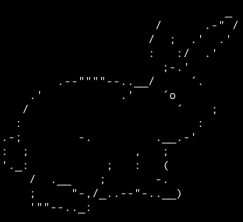
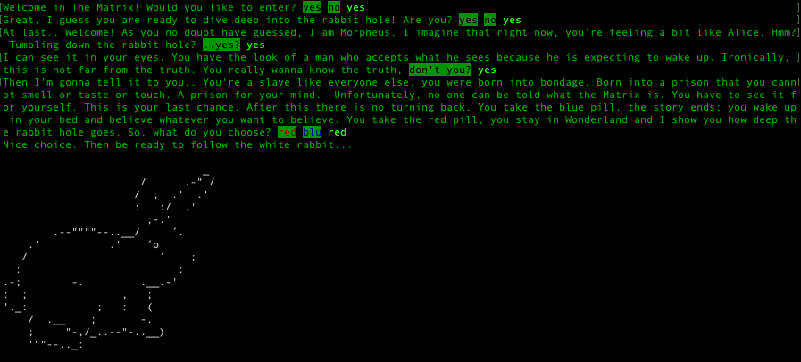
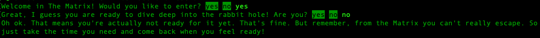

  

# Follow The White Rabbit

A text-based adventure game made during my Full-Stack Web Developer Bootcamp at [Spiced Academy](https://www.spiced-academy.com/en/program/full-stack-web-development/berlin) in Berlin.  
A compilation of multiple storylines with different endings. Every gameplay is unique according to the user's choice and the same game can be so played uniquely multiple times.

## Technologies

This project was created with the use of [Node.js](https://nodejs.org/en/about/), [Readline](https://nodejs.org/api/readline.html) and [Chalk](https://www.npmjs.com/package/chalk).

## Preview

### Story development from a positive response

 &emsp;

### Story development from a negative response

 &emsp;

